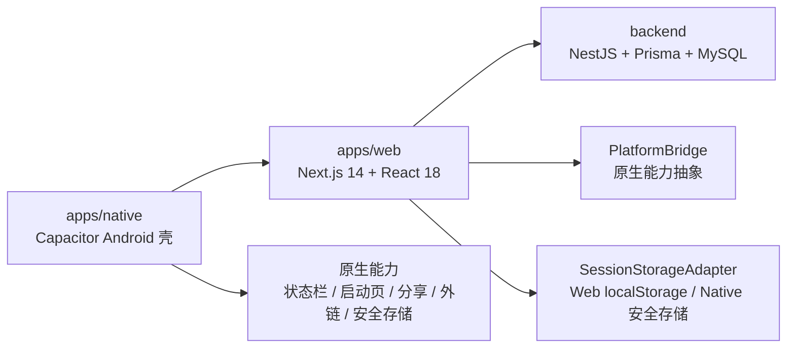

# 体重日记（Next.js + NestJS + Android 混合 App）

本仓库当前的技术方向已经明确为：

- `apps/web`：唯一业务 UI 主体，面向移动端交互
- `backend`：独立 API 服务，承载鉴权、记录、进度与用户数据
- `apps/native`：Android 混合 App 原生壳，负责容器、桥接与发布边界

当前不是 React Native 双端重写路线，而是 `Web + API + Capacitor Android 壳` 的混合架构路线。

## 当前架构



### 架构分层

- `apps/web`
  - 负责登录、首页、记录、进度、我的等业务页面
  - 负责页面状态、接口调用、交互与视觉实现
  - 通过 `PlatformBridge` 使用原生能力
  - 通过 `SessionStorageAdapter` 管理登录态
- `backend`
  - 负责 API、鉴权、用户资料、目标、记录、趋势等业务能力
  - 当前技术栈为 `NestJS + Prisma + MySQL`
- `apps/native`
  - 负责 Android 容器工程、Capacitor 配置、状态栏、启动页、外链、分享
  - release 模式下负责固定 HTTPS 入口、版本兼容闸门、本地 fallback 页
  - Native 容器中登录态持久化走安全存储

## 当前技术栈

### Web

- `Next.js 14`
- `React 18`
- `Tailwind CSS`
- `shadcn/ui`
- `Zustand`
- `Axios`

### Backend

- `NestJS`
- `Prisma`
- `MySQL`

### Android Native

- `Capacitor 8`
- `@capacitor/app`
- `@capacitor/browser`
- `@capacitor/share`
- `@capacitor/status-bar`
- `@capacitor/splash-screen`
- `@aparajita/capacitor-secure-storage`

## 当前 Native 能力状态

`apps/native` 现在已经不是纯骨架，已落地以下能力：

- Android 容器工程可生成、可同步、可打开
- `debug / test / release` 三种运行模式
- Native 安全存储接入
- `PlatformBridge` 基础能力：
  - `isNative()`
  - `share(data)`
  - `openExternalUrl(url)`
  - `getAppInfo()`
- 状态栏样式初始化
- 启动页隐藏收口
- release 模式 fallback / 维护页
- 最低 Web 版本兼容检查
- fallback 页更新 / 帮助入口

## 仓库目录

```text
.
├─ .codex/                   # 项目规则、评审清单、skills
├─ apps/
│  ├─ web/                   # Next.js Web 端，唯一业务 UI 主体
│  └─ native/                # Android 混合 App 原生壳
├─ backend/                  # NestJS + Prisma + MySQL
├─ ai/                       # AI 资产（prompts/evals/datasets/outputs）
├─ docs/                     # 产品 / 技术 / API / AI 文档
├─ infra/                    # CI/CD、部署、环境模板
├─ scripts/                  # 根目录通用脚本
└─ tests/                    # 跨服务测试
```

## 安装与启动

### 根目录推荐命令

统一在仓库根目录执行：

- 首次安装全部依赖：`npm run setup`
- 同时启动前后端：`npm run dev`
- 单独启动前端：`npm run dev:web`
- 单独启动后端：`npm run dev:backend`
- 安装原生端依赖：`npm run install:native`
- 初始化 Android 容器：`npm run native:android:add`
- 同步原生工程：`npm run native:sync`
- 原生健康检查：`npm run native:doctor`
- 编译 Android Debug 包：`npm run native:android:assemble:debug`
- 打开 Android Studio：`npm run native:open:android`

Windows 下如果 PowerShell 拦截 `npm`，请使用：

- `npm.cmd run setup`
- `npm.cmd run dev`
- `npm.cmd run native:sync`

### 端口约定

- Web 默认端口：`3000`
- Backend 默认端口：`3001`

### 说明

- 后端启动前需要先准备 `backend/.env` 和可用的 MySQL 连接
- Android 本地编译依赖本机 JDK 与 Android Studio
- `npm run dev` 会自动清理常见的开发端口占用，减少反复重启时的手工处理

## Native 联调

### 原生端环境文件

推荐直接从样例复制：

- `apps/native/.env.debug.example`
- `apps/native/.env.test.example`
- `apps/native/.env.release.example`

关键变量：

- `NATIVE_APP_MODE=debug|test|release`
- `NATIVE_WEB_APP_URL`
  - 仅供 `debug` / `test`
- `NATIVE_RELEASE_WEB_APP_URL`
  - 仅供 `release`
- `NATIVE_MIN_WEB_APP_VERSION`
  - release 最低兼容 Web 版本
- `NATIVE_RELEASE_UPDATE_URL`
  - fallback 页更新入口
- `NATIVE_RELEASE_SUPPORT_URL`
  - fallback 页帮助入口

### 推荐流程

1. 启动前后端：`npm.cmd run dev`
2. 准备 `apps/native/.env`
3. 执行：`npm.cmd run native:sync`
4. 执行：`npm.cmd run native:doctor`
5. 需要命令行编译时执行：`npm.cmd run native:android:assemble:debug`
6. 执行：`npm.cmd run native:open:android`

完整联调手册见：

- [Android 本地联调手册](/D:/project/my/ai/ai/docs/tech/runbooks/android-hybrid-app-local-debug.md)

## 文档入口

### 架构与执行

- [项目结构](/D:/project/my/ai/ai/docs/tech/architecture/project-structure.md)
- [Android 混合 App 方案](/D:/project/my/ai/ai/docs/tech/architecture/android-hybrid-app-plan.md)
- [Android 混合 App 执行清单](/D:/project/my/ai/ai/docs/tech/architecture/android-hybrid-app-delivery-checklist.md)
- [Android 本地联调手册](/D:/project/my/ai/ai/docs/tech/runbooks/android-hybrid-app-local-debug.md)

### 需求与进度

- [需求设计进度](/D:/project/my/ai/ai/docs/tech/design/requirements/index.md)
- [当前 PRD](/D:/project/my/ai/ai/docs/product/prd/2026-03-13-prd-v2.md)

### 留痕

- [Changelog 说明](/D:/project/my/ai/ai/docs/tech/changelog/README.md)
- [会话日志 2026-03-17](/D:/project/my/ai/ai/docs/tech/changelog/conversations/2026-03-17.md)

## 当前仓库约定

- 根目录 `package.json` 只做脚本调度，不承载业务代码依赖
- 需求交付顺序为：后端设计 -> 前端设计 -> 后端编码 -> 前端编码
- Native 工程轨道单独推进，但业务页面仍默认复用 `apps/web`
- release 模式不允许继续依赖任意远程调试地址

## 建议阅读顺序

1. [Android 混合 App 方案](/D:/project/my/ai/ai/docs/tech/architecture/android-hybrid-app-plan.md)
2. [Android 混合 App 执行清单](/D:/project/my/ai/ai/docs/tech/architecture/android-hybrid-app-delivery-checklist.md)
3. [需求设计进度](/D:/project/my/ai/ai/docs/tech/design/requirements/index.md)
4. [Android 本地联调手册](/D:/project/my/ai/ai/docs/tech/runbooks/android-hybrid-app-local-debug.md)
5. [Changelog 说明](/D:/project/my/ai/ai/docs/tech/changelog/README.md)
